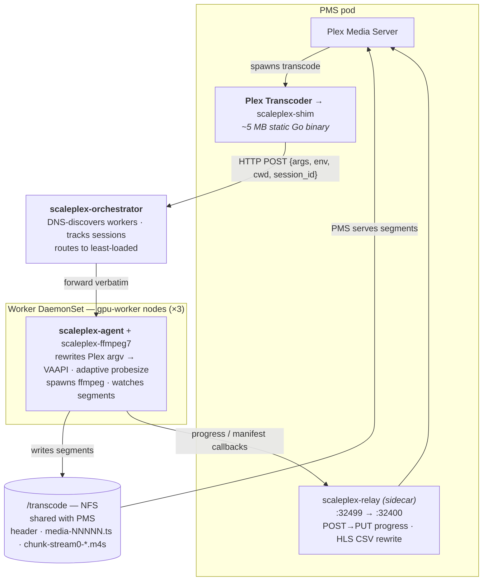

# scaleplex

Distributed Plex Media Server transcoding fleet, without the `Plex Transcoder`
binary on workers.

[Why](#why) — [Status](#status) — [Architecture](#architecture) —
[Deploy](#deploy) — [Docs](#docs)

## Why

[clusterplex](https://github.com/pabloromeo/clusterplex) hits the limits of
running Plex's bundled `Plex Transcoder`: musl ffmpeg blocks Intel NEO OpenCL,
the Plex build excludes `tonemap_vaapi`, the `inlineass` filter is
Plex-private, and `LOCAL_RELAY` adds an HTTP hop on every segment. scaleplex
keeps the distributed-transcode shape but swaps workers to **stock ffmpeg**
(scaleplex-ffmpeg7 — jellyfin-ffmpeg + a small Plex-backport patch layer in
[`scaleplex-ffmpeg/`](scaleplex-ffmpeg/)) with full VAAPI HW filters.

Concretely this unlocks:

- HW HDR→SDR tone-mapping — honored from Plex's argv (OpenCL,
  algorithm-selectable; `tonemap_vaapi` via the `SCALEPLEX_TONEMAP` knob)
- HW subtitle burn-in: one fork-native `inlineass` filter with a
  single-input VAAPI VPP branch — text (SRT/ASS), animated ASS, and bitmap
  (PGS/DVD) all burned on the GPU (render-once-per-cue, no framesync), with a
  CPU FFDraw fallback selected by the negotiated frame format
- HDR Main10 passthrough where the client supports it
- Direct NFS segment writes — no `LOCAL_RELAY` HTTP hop
- First-frame latency as a first-class design goal (see [docs/LATENCY.md](docs/LATENCY.md))
- Independence from Plex's bundled ffmpeg version

PMS still sees a normal local transcoder via a thin shim. Plex session
bookkeeping is unchanged.

## Status

**v1.9.0 — multi-backend workers + heterogeneous fleet + complete Plex-Pass gate.**
scaleplex workers now transcode on **Intel (VAAPI)**, **NVIDIA (NVENC/NVDEC)**, or
**CPU (software)** from a single image — `WORKER_BACKEND=auto` auto-detects the
hardware (`/dev/nvidia0` → nvenc, else a DRM render node → vaapi, else sw). Every
worker **reshapes whatever argv PMS emits into its own backend** (the cross-backend
rewriter), so a VAAPI-configured PMS can dispatch to an NVIDIA *or* CPU worker and
a mixed fleet needs no per-worker tuning. The orchestrator is **capability-aware** —
it tiers HW workers above SW and offers pluggable load-balancing
(`SCALEPLEX_LB_STRATEGY` = `load` | `round-robin` | `least-sessions`,
`SCALEPLEX_PREFER_HW`). HW transcoding is **Plex-Pass-gated** end-to-end (L1 startup
warning + L2 dockermod reads `myPlexSubscription` from Preferences.xml + L3 worker
self-gate, fail-closed), so `SCALEPLEX_FORCE_HW` can't hand a non-Pass account HW it
isn't entitled to. Validated by an every-shape T3 sweep (dash+hls × all four
playback muxers × sdr/hdr-tonemap × text/bitmap sub-burn × HW/SW) — **40/40 worker
PASS**. See [Backends & heterogeneous fleet](#backends--heterogeneous-fleet) and
[`docs/HW_PROFILE.md`](docs/HW_PROFILE.md). *(v1.7.0: rewriter orthogonality
complete; v1.8.0: Docker / docker-compose deployment + 3 worker-discovery modes —
see CHANGELOG.)*

**v1.6.1 — bitmap sub-burn unified onto `inlineass` + PGS cue-clear fix +
orthogonal SW-reshape detector.** v1.3.0 put all sub burn-in into one fork-side
`inlineass` filter; v1.6.1 completes the unification on the **rewriter side**:
`detectBitmapOverlayBurn` extracts the orthogonal facts (stream spec, target
W/H, optional tonemap algo) from Plex's `sub2video → scale-to-output →
overlay_vaapi` shape — *with or without an intervening tonemap* — and
`composeBurn` re-emits the canonical
`[0:0] → [hwupload]? → scale_vaapi(p010|nv12) → [tonemap]? → inlineass(render_height)`
graph. The HDR + burned-PGS + tonemap case (which previously escaped the
optimizer and ran ~0.37× realtime through Plex's full-frame overlay + a
decode→sysmem→re-upload round-trip) now runs **~4.6× realtime** end-to-end.
Fork patch `0121` makes `vf_inlineass::refresh_bitmap`'s clear *sticky*
(`bmp_end_ms = time_ms` on clear) — PGS cues stop resurrecting one frame after
the empty-PCS clear (a bug latent in `0115` since v1.3.0). Rewriter dispatch
swapped onto `extractGraphFacts → composeBurn` — **4 of 6 `reFilter*` regexes
removed**, parity vs corpus 1369/1369. *(v1.6.0: GPU-resident OpenCL HDR
tonemap fix — see CHANGELOG.)*

**v1.5.0 — paced self-decode for `-map_inlineass`.** The subtitle stream that
feeds `inlineass` decodes via a **sink-less decoder** (no output stream/encoder/
muxer), paced by the demux's video-read backpressure; the rewriter drops Plex's
`-f null` decode-sink. This removes the embedded-sub **startup-skip burst** (the
old null-mux was an unthrottled reader that pulled the demuxer through the file
during buffer fill). Live in prod, validated at 4K HDR (play + seek). See
[`docs/PACED_SELF_DECODE.md`](docs/PACED_SELF_DECODE.md). *(v1.4.0: rewriter→fork
migration + honor-Plex-HW/SW — see CHANGELOG.)*

**v1.3.0 — subtitle burn-in unification.** All HW sub burn-in moves into one
fork-native `inlineass` filter with a single-input VAAPI VPP branch (merged
from the `overlay_sub_vaapi` prototype): libass renders each cue once on-change
to a cached VAAPI surface and VPP-blends it onto the video — no second ffmpeg
process, no qtrle FIFO, no `overlay_vaapi` framesync, no `__SP_BAND*` sentinel
machinery. Text (SRT/ASS), animated ASS (`animated_tier_down`), PGS/DVD bitmap
(in-filter `replay_bitmap`), and native seek are all handled in-filter; the SW
FFDraw path is the CPU fallback, chosen by negotiated frame format. The
rewriter shed ~427 lines (the whole pre-render orchestration). Validated at 4K
on plex-test (HW SRT / PGS / animated ASS, SW fallback) — ~0.13 core (4K SRT) /
~0.44 core (4K PGS) per session. See [docs/UNIFIED_SUB_FILTER.md](docs/UNIFIED_SUB_FILTER.md).

**v1.2.1 — tight pre-render band for sidecar SRT.** On top of v1.2's
PGS HW-decode pre-render + HDR pass-through + ffmpeg base v7.1.3-6,
v1.2.1 parses sidecar SRT cues at rewrite time and sizes the
pre-render bottom band to the actual max-lines-per-cue + safety
margin instead of the static 40% fallback. Live readings on 4K HEVC
HDR + sidecar SRT: pre-render CPU 47 % → 28 %, total session
1.69 → 1.31 cores (~22 % saved per session). Bails to the static band
on positional cues (`\anN`>3, `\pos(...)`, `\move(...)`); embedded
SRT keeps the static band (extraction happens post-rewrite — tracked
for v1.2.2 multi-region pre-render).

**v1.2 — PGS HW-decode pre-render + HDR tonemap pass-through + ffmpeg
base v7.1.3-6.** Every client/format cell in the matrix below has been
exercised end-to-end (initial play, seek, quality change, subtitle
burn-in as applicable) on the scaleplex PMS deployment. v1.2 adds the
HW-decode bitmap (PGS / VobSub / DVDSub) pre-render path with seek-
offset FIFO alignment, AV1 HW-decode hardening (steady overlay stream,
no surface-pool overruns), HDR PQ source passthrough across all
sub-burn graphs, sub pre-render codec ffv1 → qtrle (~9× less encode
CPU on the pre-render), SRT bottom-band crop (~2.5× less canvas-cost
on the burn), and rebases the `scaleplex-ffmpeg` fork onto
jellyfin-ffmpeg v7.1.3-6:

| Client / format | Play | Seek | Subs | Notes |
|---|:-:|:-:|:-:|---|
| Plex Web — DASH (Chrome / Firefox) | ✓ | ✓ | ✓ | Burn-in + text-sub side-channel (`-segment_format ass`) |
| Plex Android — HLS mpegts | ✓ | ✓ | ✓ | |
| Plex Android — HLS matroska (4K HDR + 5.1 EAC3) | ✓ | ✓ | ✓ | mkv-in-`.ts` when codec/audio can't fit mpegts |
| Plex Windows desktop — segmented matroska | ✓ | ✓ | ✓ | Cosmetic playhead-reset on seek — see [`docs/KNOWN_ISSUES.md`](docs/KNOWN_ISSUES.md) |
| LG webOS — HLS (4K HEVC HDR) | ✓ | ✓ | ✓ | PGS overlay + SRT burn-in |
| Plex Optimize (HW-decode + remux fast-path) | ✓ | n/a | ✓ | mp4 + faststart, multi-track audio, sidecar SRT copy |
| PMS Detection / ML pre-pass | ✓ | n/a | n/a | bail-path scrub — ffmpeg runs the original argv cleaned of Plex-private flags |

**Source matrix:** AV1 + HEVC + H264; SDR + HDR10; embedded and sidecar
SRT / ASS text subs and embedded PGS / DVD bitmap subs — **all** burned on
the GPU via the single fork-native `inlineass=` filter (text through libass,
bitmap through in-filter `replay_bitmap`, animated ASS at one tier lower via
`animated_tier_down`). HDR→SDR tone-mapping honored from Plex's argv.

**Resilience:** PMS `canThrottle` pass-through, multi-engine GPU load
reporting, transparent mid-stream worker recovery across DaemonSet rolls
(see [`docs/RESILIENCE.md`](docs/RESILIENCE.md)).

**Deployment scope.** v1.2 is a code milestone — the software is
release-ready. Pointing any particular PMS instance at scaleplex is an
independent operational decision, not gated on this tag.

**Images** are sha-pinned — CI publishes `ghcr.io/varashi/scaleplex_worker`,
`scaleplex_orchestrator`, and `scaleplex_pms_dockermod` as `sha-<short>`;
the Helm release pins each tag explicitly.

## Backends & heterogeneous fleet

scaleplex workers transcode on three backends, selected per worker at startup via
`WORKER_BACKEND`:

| `WORKER_BACKEND` | Hardware | Pipeline |
|---|---|---|
| `auto` *(default)* | probe | `/dev/nvidia0` → nvenc; else a DRM render node (`/dev/dri/renderD*`) → vaapi; else sw |
| `vaapi` | Intel / AMD GPU (`/dev/dri`) | VAAPI HW decode + `h264_vaapi` / `hevc_vaapi`, iHD/OpenCL tonemap |
| `nvenc` *(alias `nvidia`)* | NVIDIA GPU | NVDEC + `h264_nvenc` / `hevc_nvenc`, `tonemap_cuda` |
| `sw` *(alias `cpu`)* | none | SW decode + `libx264` / `libx265`, zscale tonemap |

**One image** carries every runtime (VAAPI userspace + CUDA + the fork ffmpeg); the
deployment's hardware grant decides what a worker *becomes* — docker `devices: /dev/dri`
(Intel) / `runtime: nvidia` (NVIDIA) / nothing (CPU), or the matching k8s
device-plugin + nodeSelector. Plex only transcodes to **h264/hevc** (no AV1 encode),
both handled by every backend, so there's no per-codec capability gap.

**Cross-backend reshape.** Each worker rewrites whatever argv PMS emits — VAAPI,
NVENC, or pure-SW shape — into its *own* backend before running it: decode flags, the
filter graph (scale / tonemap / sub-burn), and the encoder. So a heterogeneous fleet
(some Intel, some NVIDIA, some CPU; a PMS with or without a GPU) needs no per-worker
tuning — add a worker of any kind and it adapts. The reshaper is orthogonal
(`extractGraphFacts → composeBurn`), and emits Plex's own stock shapes so the fork
sees stock-Plex args.

**Scheduling** (orchestrator env). `SCALEPLEX_PREFER_HW=1` (default) tiers HW workers
above SW (a CPU worker is overflow, not first pick); `SCALEPLEX_LB_STRATEGY` =
`load` *(default)* | `round-robin` | `least-sessions` | `random` orders within a
tier. NVIDIA + CPU load is reported on `/capability` alongside Intel so routing is
capacity-aware. On a homogeneous fleet this collapses to the prior least-loaded
behaviour. Workers expose their `backend` on `/capability` and the orchestrator's
`/workers` JSON.

**Plex-Pass gate.** Plex HW transcoding is a Plex-Pass feature — PMS only emits HW
argv with an active Pass. scaleplex's HW *re-acceleration* (`SCALEPLEX_FORCE_HW=1`,
or a cross-backend reshape) is gated on a confirmed active Pass: **L1** startup
warning, **L2** the PMS dockermod reads `myPlexSubscription` from `Preferences.xml`
and forwards `SCALEPLEX_PASS_ACTIVE` per session, **L3** a worker self-gate
(fail-closed). Without a Pass, a forced session falls back to Plex's emitted SW
pipeline. Detail + the override semantics in [`docs/HW_PROFILE.md`](docs/HW_PROFILE.md).

## Architecture



**Boundary:** PMS only needs to see segments on disk and receive HTTP
callbacks (progress, manifest body). The relay sidecar gives ffmpeg a
loopback-equivalent endpoint to call back on (workers can't reach PMS's
127.0.0.1:32400 directly). Everything else flows over normal cluster Services.

## Repo layout

| Path | Purpose |
|---|---|
| `shim/cmd/shim/` | `Plex Transcoder` replacement. Static Go binary. |
| `shim/cmd/relay/` | Forward proxy on PMS pod (POST→PUT for `/progress`, CSV rewrite for HLS `/manifest`). |
| `shim/Dockerfile` | DOCKER_MOD image: drops shim into `/usr/lib/plexmediaserver/` + relay as s6-v3 longrun. |
| `orchestrator/` | Slim Go HTTP server. DNS-discovers workers, picks least-loaded. |
| `worker/agent/` | Worker-side daemon. Rewrites argv, spawns ffmpeg, posts progress, watches segments. |
| `worker/Dockerfile` | Ubuntu 24.04 + scaleplex-ffmpeg7 + iHD VAAPI + agent. |
| `worker/deploy/` | DaemonSet + namespace YAML. |
| `orchestrator/deploy/` | Deployment YAML. |
| `deploy/docker/` | docker-compose + multi-host `docker run` recipes for non-k8s users. |
| `scaleplex-ffmpeg/` | Patch layer + Debian build pipeline for `scaleplex-ffmpeg7` (jellyfin-ffmpeg + Plex backports). |
| `charts/scaleplex/` | Helm chart (placeholder; deploy via raw YAML for now). |
| `docs/` | Architecture, rewriter, seek, latency, lessons. |

## Deploy

scaleplex supports **two deployment shapes**, with the same three
components either way (worker, orchestrator, PMS docker-mod), and
neither one owns the PMS pod — rollback is a one-line revert in both.

- **Kubernetes (recommended)** — DaemonSet worker + Deployment
  orchestrator + `DOCKER_MODS` on the existing PMS pod. See the next
  section.
- **Docker / docker-compose** — single-host compose for all-in-one,
  or per-host `docker run` for multi-host fleets. Three worker
  discovery modes (DNS / `WORKERS_LIST` / worker push-register).
  See [`deploy/docker/`](deploy/docker/).

**Security posture.** scaleplex is HTTP plaintext on a trusted LAN by
design — no built-in auth or TLS. Wrap with a reverse proxy
(Caddy/Traefik) if your subnet has untrusted devices. Cross-site / WAN
workers are tracked as a future feature (the data plane assumes a
shared filesystem today).

### Deploy — Kubernetes

Three things added to the cluster:

1. **Worker** — a DaemonSet, one pod per GPU node (Intel iGPU / Arc,
   `/dev/dri/render*`). Pre-warms VAAPI; `/readyz` gates on warm-up.
2. **Orchestrator** — a stateless Deployment. DNS-discovers workers via
   a headless Service and routes each task to the least-loaded one.
3. **PMS DOCKER_MOD** — on your existing PMS container, point
   `DOCKER_MODS` at `scaleplex_pms_dockermod`. The mod lays down the
   shim as `Plex Transcoder`, runs the relay sidecar, and bundles the
   optional [clientfix](docs/CLIENTFIX.md) longrun (idle unless you
   target it — see [clientfix below](#clientfix--optional-network-dependent)):

   ```yaml
   env:
     DOCKER_MODS: ghcr.io/varashi/scaleplex_pms_dockermod:sha-<short>
     LOCAL_RELAY_PORT: "32499"
     SCALEPLEX_ORCHESTRATOR_URL: http://<orchestrator-service>.<namespace>.svc:3500
   ```

The worker + PMS pods must share the NFS volumes PMS transcodes into
(`/transcode`) and reads media from (`/media`) — the worker writes
segments exactly where the PMS serves them.

#### Namespace topology — pick one

The worker wants `CAP_PERFMON` to read the i915 hardware PMU for
GPU-busy load telemetry (needed on GPUs with no sysfs busy file, e.g.
Intel Arc). `PERFMON` is on Pod Security Admission's `privileged`-only
allowlist. That forces a choice:

- **A — fold into the PMS namespace.** Run the worker + orchestrator in
  the same namespace as your PMS. Simplest — the worker reuses the PMS's
  exact `/transcode` + `/media` volume definitions, so the paths cannot
  drift. Cost: that namespace must be PSA `privileged`. Fine for a
  single-operator cluster where you control every manifest.
- **B — dedicated `scaleplex` namespace.** Keeps your PMS namespace at
  PSA `baseline`; only the `scaleplex` namespace is `privileged`. You
  must configure the worker fleet to mount the **same** `/transcode` NFS
  export the PMS uses.

Either way the worker carries `cap_perfmon=ep` as a file capability so
only the agent binary gets the bits, not the whole container. If you'd
rather keep every namespace at `baseline`, drop the `PERFMON` capability
entirely — the worker falls back cleanly and the orchestrator
load-balances on session count instead of GPU-busy %.

**Rollback** — remove the `DOCKER_MODS` env from the PMS container. The
shim's cont-init script restores `Plex Transcoder.real` on next PMS
start. The worker DaemonSet and orchestrator can be left running or
removed independently; they are inert without the shim feeding them.

**Helm.** scaleplex is deployed in the reference setup as a
[bjw-s `app-template`](https://github.com/bjw-s-labs/helm-charts)
HelmRelease — homelab-familiar, and it keeps storage / networking /
scheduling fully in the operator's hands. A reference `values.yaml`
fragment carrying the scaleplex-structural pieces (worker DaemonSet
shape, headless discovery Service, PERFMON cap) is the planned
distribution artifact; a dedicated first-party chart is a possible
follow-up if the reference proves clumsy. The `charts/scaleplex/`
directory is a placeholder.

### clientfix — optional, network-dependent

[`clientfix`](docs/CLIENTFIX.md) is a **fourth, optional** component. It fixes
bugs in a *client's* HTTP capability negotiation (today only Plex for Apple TV
8.45) by reshaping the PMS transcode **decision** — the worker can't, since PMS
builds the playlist before any worker is involved. **If you don't have an
affected client, don't deploy it** — it changes nothing for the transcode path.

It ships **two ways** (both inert by default):

- **In-pod (bundled in the dockermod)** — already in `scaleplex_pms_dockermod`
  as an s6 longrun, **idle unless** you point the PMS Service/LB at its port
  (`CLIENTFIX_LISTEN_ADDR`, default `:32401`). PMS then sees loopback →
  honours `X-Forwarded-For`.
- **Standalone Deployment** — `scaleplex_clientfix` fronting the LoadBalancer
  (`LB → clientfix → PMS`). Bumping it never rolls the PMS pod.

**Whether you need the TLS-SNI front depends on your ingress topology.**
clientfix is plaintext HTTP:

- **Behind a TLS-terminating gateway/reverse-proxy** (Envoy/Caddy/Traefik →
  plaintext to clientfix): nothing extra — leave `CLIENTFIX_TLS_*` unset.
- **Directly on a raw-TLS ingress** (the LB / `plex.direct` port-forward, which
  also carries Plex's HTTPS **reachability probe**): set
  `CLIENTFIX_TLS_CERT`/`KEY` to your own cert for a domain you control. clientfix
  then passes `plex.direct` TLS straight through to PMS (probe stays reachable —
  otherwise PMS flaps "remote access down") and terminates your custom domain
  for the decision rewrite. See [`docs/CLIENTFIX.md`](docs/CLIENTFIX.md#tls-sni-front-the-lb-path).

**Rollback** — point the Service/LB back at PMS (`:32400`) / drop the standalone
Deployment. No PMS change.

### Deploy — Docker / docker-compose

For homelabs without a Kubernetes cluster. The same three components
(worker, orchestrator, PMS docker-mod) run as plain Docker containers.

- **Single-host all-in-one** — [`deploy/docker/compose.yaml`](deploy/docker/compose.yaml)
  brings up orchestrator + 1 worker on one host; uncomment the
  `plex` stanza to add a linuxserver/plex container wired to the
  scaleplex shim via `DOCKER_MODS`. Edit
  [`deploy/docker/.env.example`](deploy/docker/.env.example) to point
  at your `/media` + `/transcode` paths and `docker compose up -d`.
- **Multi-host fleet** — see
  [`deploy/docker/multi-host.md`](deploy/docker/multi-host.md) for
  `docker run` recipes per host. Three discovery modes coexist:
  - **DNS** (`WORKERS_DNS` on orchestrator) — k8s pattern, also works
    on docker compose where the service name resolves on the bridge.
  - **LIST** (`WORKERS_LIST=host1:3501,host2:3501` on orchestrator) —
    static comma-separated, no DNS needed.
  - **PUSH** (`SCALEPLEX_ORCHESTRATOR_URL` on each worker) —
    friction-free: a new `docker run` joins the fleet automatically;
    workers heartbeat every 5s, reaped after 15s of silence.

Multi-host requires the same `/transcode` (rw) and `/media` (ro)
visible on every worker host AND PMS — typically an NFS export. No
auth, no TLS; LAN-only by design.

## Docs

- [`docs/ARCHITECTURE.md`](docs/ARCHITECTURE.md) — components, data flow, where state lives, backend dialects + cross-backend reshape.
- [`docs/HW_PROFILE.md`](docs/HW_PROFILE.md) — backends, heterogeneous-fleet config, orchestrator scheduling knobs, the Plex-Pass gate.
- [`docs/REWRITER.md`](docs/REWRITER.md) — every Plex-private argv quirk and its stock-ffmpeg translation.
- [`docs/TUNING.md`](docs/TUNING.md) — operator env knobs for transcode quality + behaviour.
- [`docs/SEEK.md`](docs/SEEK.md) — DASH and HLS seek deep-dive (the hardest problems we shipped).
- [`docs/LATENCY.md`](docs/LATENCY.md) — first-frame latency budget and design levers.
- [`docs/RESILIENCE.md`](docs/RESILIENCE.md) — PMS canThrottle pass-through, multi-engine GPU load, mid-stream worker recovery.
- [`docs/KNOWN_ISSUES.md`](docs/KNOWN_ISSUES.md) — tracked limitations as of v1.2.1.
- [`CHANGELOG.md`](CHANGELOG.md) — release notes.
- [`docs/PLAN.md`](docs/PLAN.md) — original implementation plan (historical; mostly delivered).
- [`docs/LESSONS-FROM-CLUSTERPLEX.md`](docs/LESSONS-FROM-CLUSTERPLEX.md) — concrete pitfalls scaleplex avoids by design.

## Lineage

scaleplex inherits the lessons from
[Varashi/clusterplex#rewriter-plan](https://github.com/Varashi/clusterplex/tree/rewriter-plan).
clusterplex's `argRewriter.js` seeded `worker/agent/rewriter.go`, but the
Go port runs on the worker (where `/media` is locally mounted) instead of
on the orchestrator, so sidecar SRT/ASS lookups happen with direct fs
access rather than over a socket.io detour.
